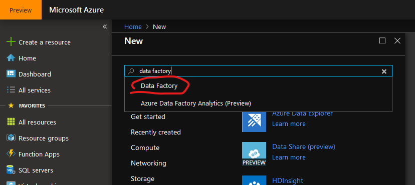
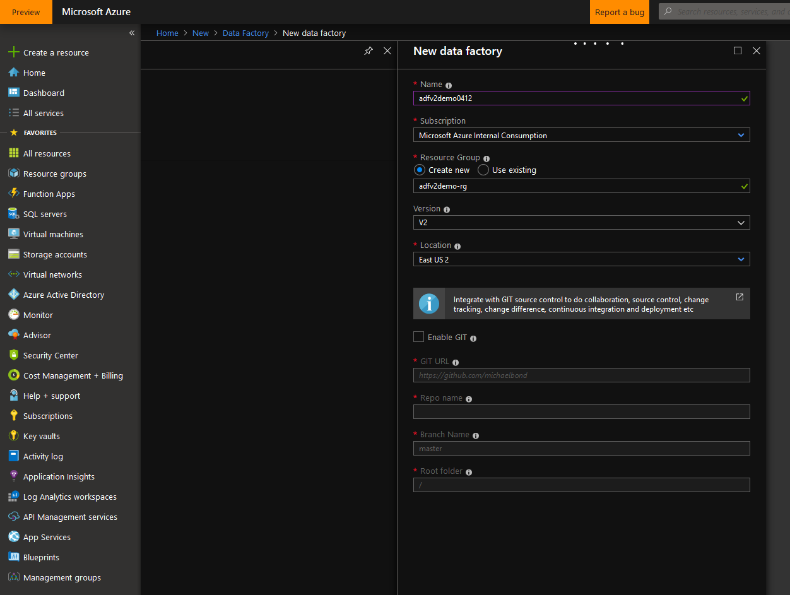
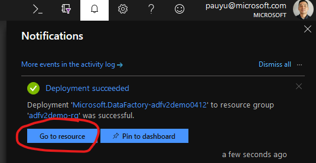
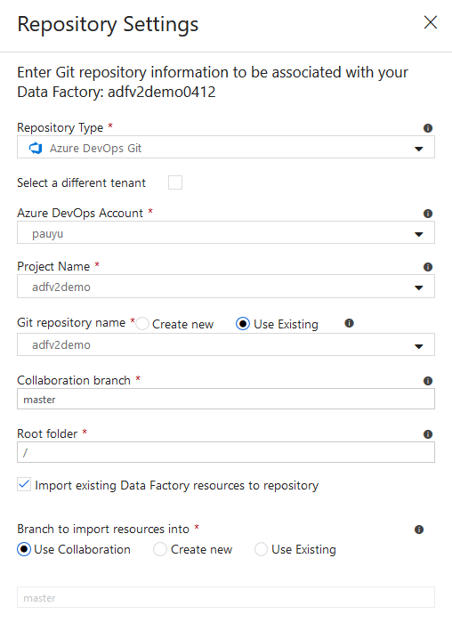
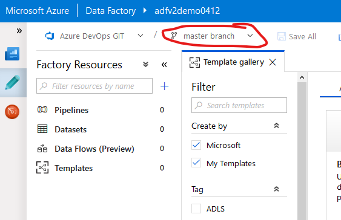

# Azure Data Factory V2 Demo

## Provision Azure Data Factory V2

1. Log into [Azure Portal](https://portal.azure.com)

1. Click **+Create a resource** link at top left of the page

1. In the Azure Marketplace search bar, type "**data factory**" and click on "**Data Factory**" that appears in the drop down list

    

1. Click **Create** button

1. Enter the following and click **Create**:
    - Name: *adfv2demo0412* **(NOTE: Must be globally unique)**
    - Resource Group: Select **Create new** and enter *adfv2demo-rg*
    - Version: *V2*
    - Location: *East US 2*
    - Skip Git integration for now

        

1. Check the **Notifications** icon in the upper right and wait until you see "**Deployment succeeded**" then click the "**Go to resource**" button

    

1. Click on "**Author & Monitor**" to navigate to the Azure Data Factory web framework. This is where ADF development will take place.

## *OPTIONAL - Configure Git Repository*

> If you are using Azure DevOps, you must have your Azure DevOps Organization already created prior to proceeding.
>
> If you are using GitHub, you must have your repo already created prior to proceeding.

1. On the ADF overview page, click "**Set up Code Repository**"

    

1. Select **Repository Type**" and select the appropriate organization/project/branch

    - Azure DevOps

        

    - GitHub

        

1. In the Overview page, click **Create pipeline from template** button

    

1. If prompted, select the working branch

    

1. Verify the correct branch is selected

    

