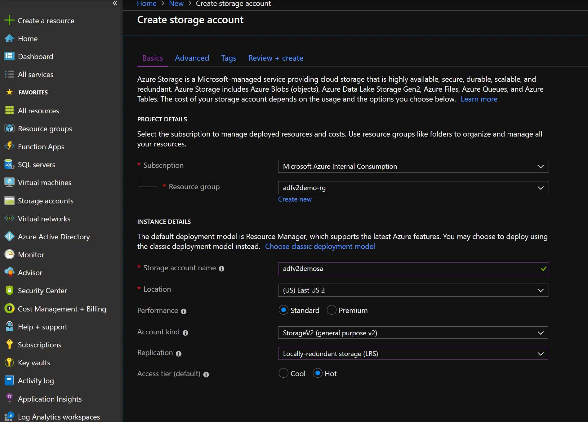
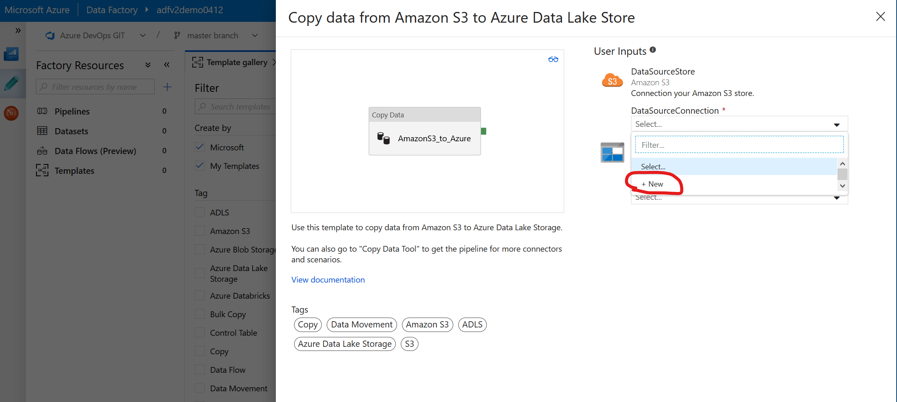
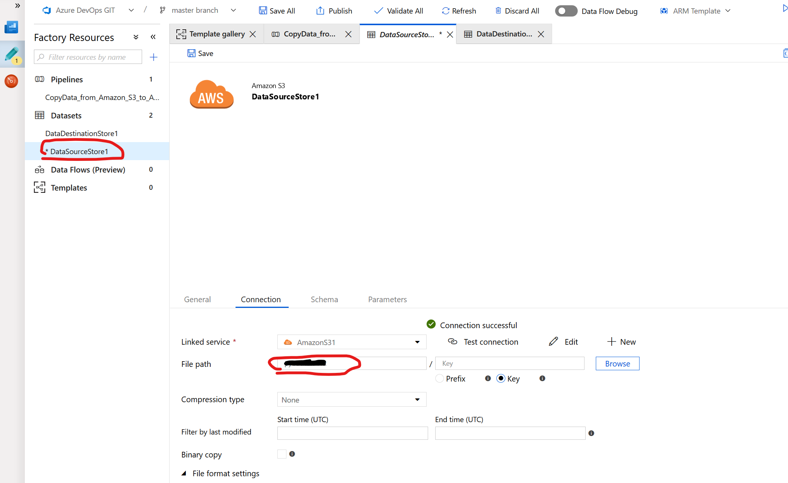
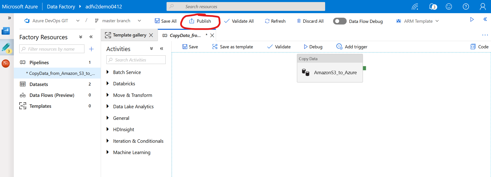
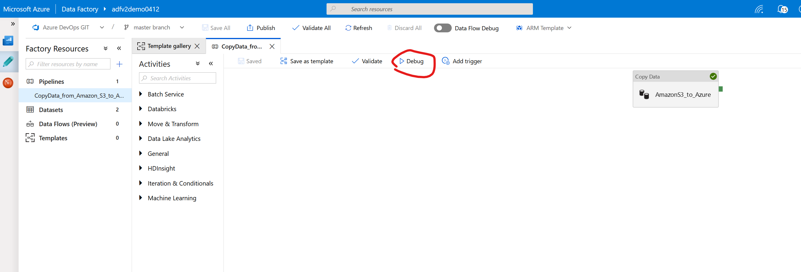
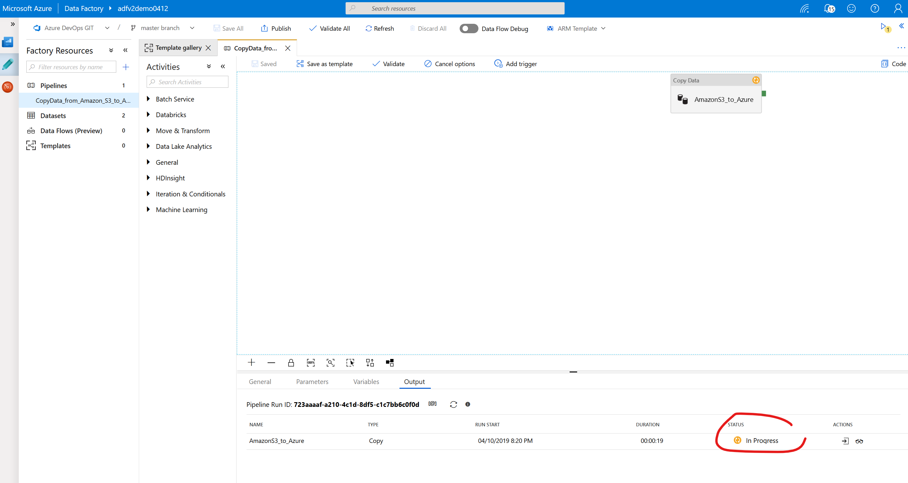

# Azure Data Factory V2 Walkthrough

## Provision Azure Data Factory V2

1. Log into [Azure Portal](https://portal.azure.com)

1. Click **+Create a resource** link at top left of the page

1. In the Azure Marketplace search bar, type **data factory** and click on **Data Factory** that appears in the drop down list

    

1. Click the **Create** button.

1. Enter the following and click **Create**:
    - Name: *adfv2demo0412* **(NOTE: Must be globally unique)**
    - Resource Group: Select **Create new** and enter *adfv2demo-rg*
    - Version: *V2*
    - Location: *East US 2*
    - Skip Git integration for now

        

1. Check the **Notifications** icon in the upper right and wait until you see **Deployment succeeded** then click the **Go to resource** button.

    

1. Click on **Author & Monitor** to navigate to the Azure Data Factory web framework. This is where ADF development will take place.

## *OPTIONAL - Configure Git Repository*

> NOTE: If you are using Azure DevOps, you must have your Azure DevOps Organization already created prior to proceeding.

1. On the ADF overview page, click **Set up Code Repository**

    

1. Select **Repository Type** and select the appropriate organization/project/branch.

    - Azure DevOps

        

    - GitHub

        

1. In the Overview page, click the **Create pipeline from template** button.

    

1. If prompted, select the working branch.

    

1. Verify the correct branch is selected.

    

## Copy data from Amazon S3 bucket to Azure Data Lake Gen2

1. Log into [Azure Portal](https://portal.azure.com).

1. Click **+Create a resource** link at top left of the page.

1. In the Azure Marketplace page, click  **Storage** and click on **Storage account** that appears at the top of the **Featured** list.

    

1. Enter the following and click the **Next: Advanced >** button:
    - Resource Group: Select *adfv2demo-rg*
    - Name: *adfv2demosa* **(NOTE: Must be globally unique, must be lowercase and alphanumeric only)**
    - Location: *East US 2*
    - Performance: *Standard*
    - Account kind: *StorageV2 (general purpose v2)*
    - Replication: *Locally-redundant storage (LRS)*
    - Access tier (default): *Hot*

        

1. Make sure **Hierarchical namespace** under **DATA LAKE STORAGE GEN2** is set to **Enabled**

    

1. Click the **Review + create** button, then click the **Create** button.

1. Back in the ADF framework Overview page, click the **Create pipeline from template** icon.

    

1. Click on the template titled **Copy data from Amazon S3 to Azure Data Lake Store**.

    

1. Click on the dropdown under **DataSourceConnection** and click **+New**.

    

1. Enter a connection Name and your Amazon **Access Key ID** and **Secret Access Key**, click **Test connection**, then click the **Finish** button.

    

1. Click on the dropdown under **DataDestinationConnection** and click **+New**.

    

1. Enter a connection Name and select the subscription and storage account you created earlier, click **Test connection**, then click the **Finish** button.

    

1. Click the **Use this template** button.

1. In the **Factory Resources** pane, click on the **DataDestinationStore** and enter a name in the **File Path** text box, and click the **Saave** button. This will be the container in blob storage.

    

1. In the **Factory Resources** pane, click on the **DataSourceStore** and enter your Amazon S3 bucket name in the **File Path** text box, and click the **Saave** button.

    

1. If you've configure a GitHub or Azure DevOps repo, click the **Publish** button, and confirm your changes to be committed and pushed.

    

1. In the Pipeline editor, click **Debug** to execute the copy pipeline.

    

1. Monitor the pipeline execution.

    

1. Verify the data is now in your Azure Data Lake using Azure Storage Explorer

    