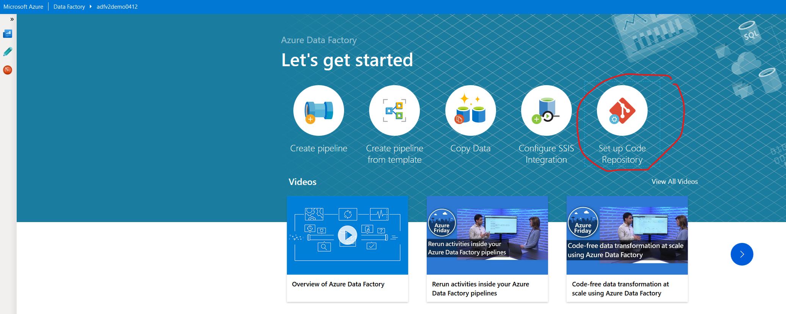
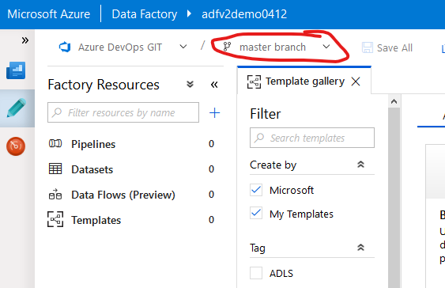

# Configure Git Repository

> NOTE: If you are using Azure DevOps, you must have your Azure DevOps Organization already created prior to proceeding.

1. On the ADF overview page, click **Set up Code Repository**

    

2. Select **Repository Type** and select the appropriate organization/project/branch.

    - Azure DevOps

        

    - GitHub

        

3. In the Overview page, click the **Create pipeline from template** button.

    

4. If prompted, select the working branch.

    

5. Verify the correct branch is selected.

    