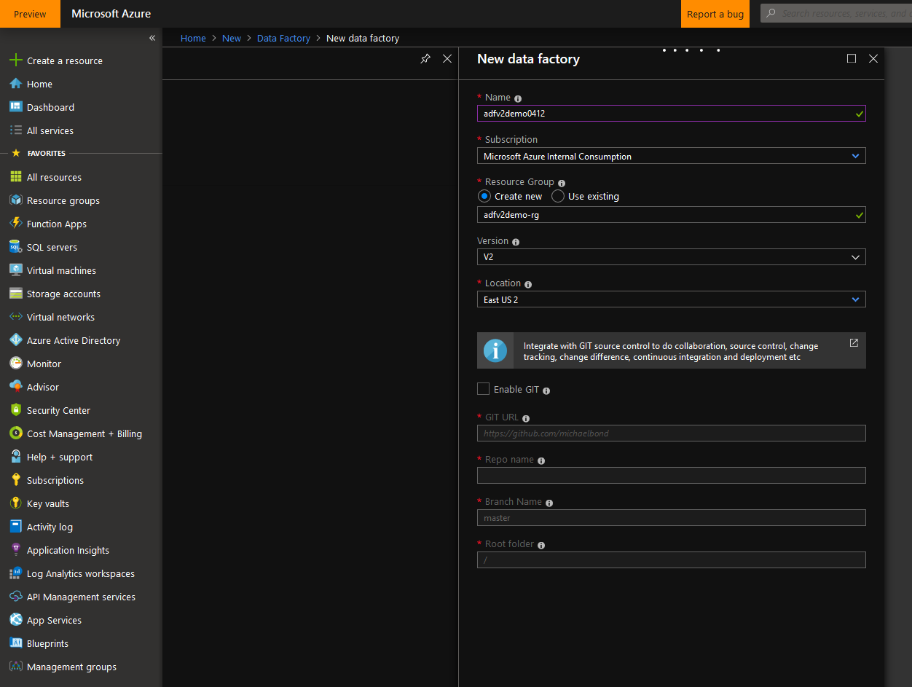
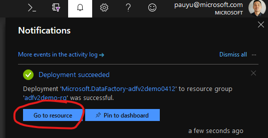

# Provision Azure Data Factory V2

1. Log into [Azure Portal](https://portal.azure.com)

1. Click **+Create a resource** link at top left of the page

1. In the Azure Marketplace search bar, type **data factory** and click on **Data Factory** that appears in the drop down list

    

1. Click the **Create** button.

1. Enter the following and click **Create**:
    - Name: *adfv2demo0412* **(NOTE: Must be globally unique)**
    - Resource Group: Select **Create new** and enter *adfv2demo-rg*
    - Version: *V2*
    - Location: *East US 2*
    - Skip Git integration for now

        

1. Check the **Notifications** icon in the upper right and wait until you see **Deployment succeeded** then click the **Go to resource** button.

    

1. Click on **Author & Monitor** to navigate to the Azure Data Factory web workspace. This is where ADF development will take place.